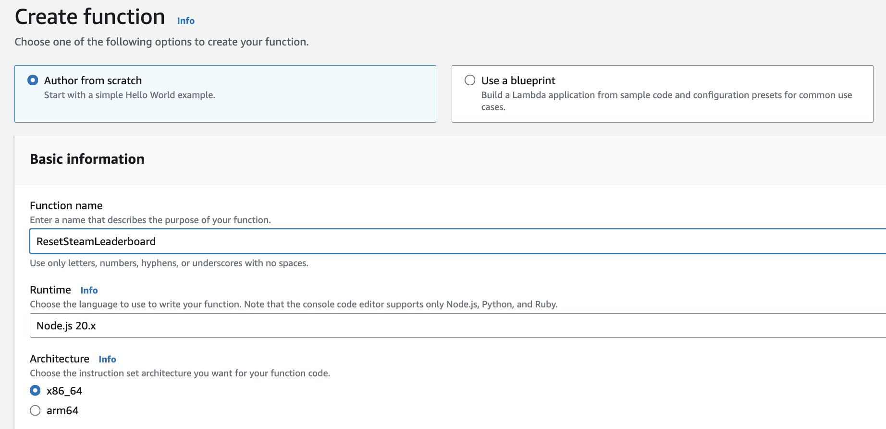
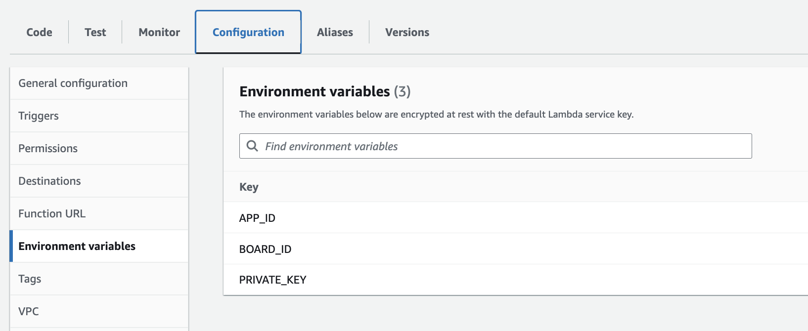
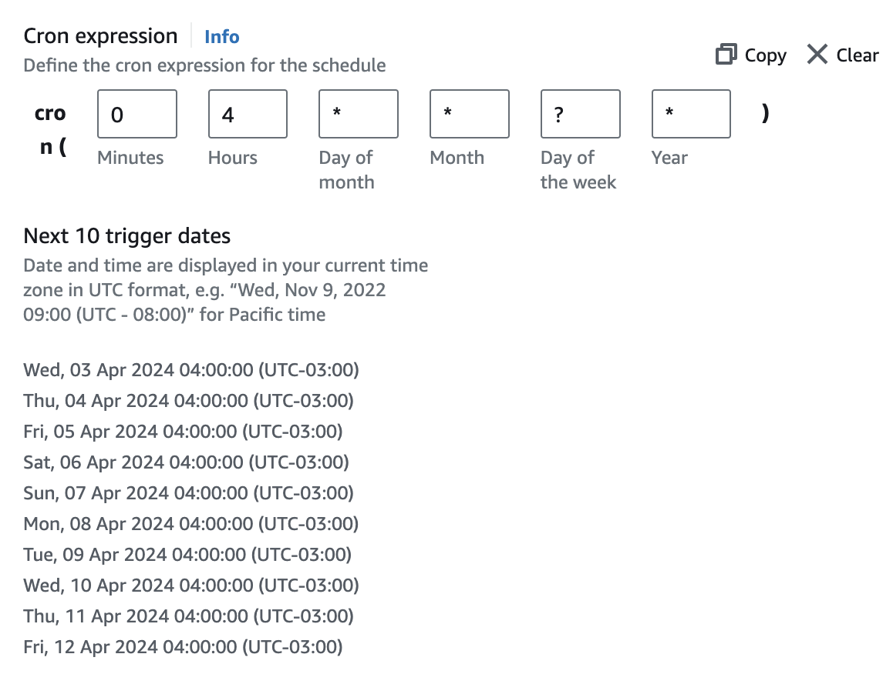

# #2 Tech Knowledge Drop - How to running code every day for free

Hi guys, this week my friend Halmenschlager went to me asking for help he had a demand to develop

I want to call the Steam API endpoint to update the leaderboard company's games every day. I don't want to create a server for this and it needs to be 0 cost.

Understanding his use case I started explain to him what he needs for accomplish this challenge.

1. He needs to understand the options that he has to run scripts without a server, in this case locally or in cloud.
2. He needs something for scheduling the task to call the API.


## How to run locally scripts without a server?

Well, we can easily run a script locally in our machine, any programming language can call APIs without need a running server.

To run every day in a week, he could use a cron job triggering the script without any hands.

Simple way to create a cron, open the terminal and run this command:

```sh
crontab -e
```

And add your schedulers like this one that runs at 04:00 a.m. every day. See more [here](https://crontab.guru/#0_4_*_*_*).

```sh
0 4 * * 0-6 /your-script-folder/script.sh > /dev/null 2>&1
```

But nothing is so simple in this life, he needs for his work, he can't run the script in his machine.

It's not secure and it's not scalable, because if someone of the company needs to maintain that script, or make it up they will not have access to it.

So we need a solution that everyone in the team can access the script.

## How to run scripts without a server in cloud?

First we need to choose our cloud provider, the big players are AWS, Microsoft Azure, and Google Cloud.

For this article we will use AWS services, which we will use:

- Amazon EventBridge Scheduler
- Lambda functions

So you guys can understand that Amazon EventBridge Scheduler will be our cron.
And the Lambda functions will be our script.


```js
import https from 'https';

// All lambda functions should exports an async handler function
export const handler = async (event) => { 
    // Fetching private key from environment variable
    const privateKey = process.env.PRIVATE_KEY;
    const appId = process.env.APP_ID;
    const boardId = process.env.BOARD_ID;

    // Configuring the endpoint
    const options = {
        hostname: 'partner.steam-api.com',
        path: `/ISteamLeaderboards/ResetLeaderboard/v1/${privateKey}+${appId}+${boardId}`,
        method: 'POST'
    };

    // Make the Request
    const req = https.request(options, (res) => {
        console.log(`statusCode: ${res.statusCode}`);

        res.on('data', (d) => {
            process.stdout.write(d);
        });
    });

    req.on('error', (error) => {
        console.error(error);
    });

    req.end();
};
```

**Step 1: Create the Lambda Function**

Go to the AWS Management Console and navigate to the Lambda service.
1. Click on "Create function".
2. Choose "Author from scratch".
3. Provide a **name** for your function, **choose "Node.js 20.x"** as the runtime.
4. Click "Create function".
5. Scroll down, go to Code tab.
6. Copy and paste the above Lambda function code into the code editor.
   


**Step 2: Set up Environment Variables**

In Lambda service
1. Go to Configuration tab
2. Select Environment variables.
3. Click on Edit, and Add environment variable in this case: PRIVATE_KEY, APP_ID, BOARD_ID



**Step 3: Create an EventBridge Scheduler**

Go to the AWS Management Console and navigate to the EventBridge Scheduler service.
1. Click on "Create Schedule".
2. Define a "name", and select "Recurring Schedule" with Cron-base
4. Define the schedule expression (e.g., cron(0 4 * * ? *) to trigger daily at 4 a.m. UTC).
5. Click "Next"
6. Select "Templated targets" and choose "AWS Lambda Invoke".
7. Select your Lambda function from the dropdown.
8. Click "Next" two times!
9. Review your Scheduler and finally click on "Create schedule"
    


That's all folks!

Feel free to comment, share it with your friends, and like it!

### References so you can study: 

https://phoenixnap.com/kb/set-up-cron-job-linux

https://crontab.guru/#0_4_*_*_*

https://docs.aws.amazon.com/lambda/latest/dg/configuration-envvars.html

https://aws.amazon.com/lambda/

https://us-east-1.console.aws.amazon.com/events/home?region=us-east-1#/
